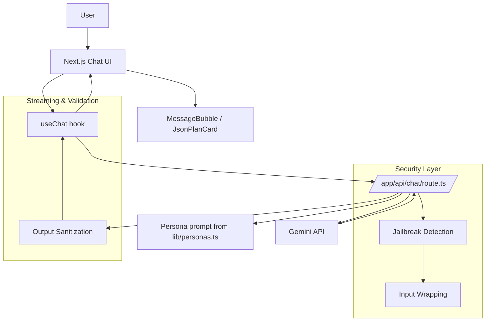

# Scaler Persona Chatbot

A persona-based AI chatbot built for Scaler Academy's Prompt Engineering assignment. The app lets you chat with three distinct Scaler personalities - Anshuman Singh, Kshitij Mishra, and Abhimanyu Saxena - using rich system prompts, streamed Gemini responses, and a responsive chat interface.

## Live Demo

Live URL: https://persona-bot-chi.vercel.app/

## What It Does

- Switch between three personas with one click.
- Reset the conversation cleanly when the persona changes.
- Stream assistant responses token by token instead of waiting for the full answer.
- Show suggestion chips for quick-start questions.
- Render markdown and structured JSON study plans as readable UI.
- Keep the Gemini API key on the server only.

## Architecture

The app is built for high reliability, state-of-the-art security, and a premium user experience. It optimizes for low latency (via streaming) and resilience (via fallback logic).

### System Shape



### Responsibility Split

1. **Client UI**: Renders the chat, persona switcher, chips, and message bubbles.
2. **`useChat` Hook**: Owns message state, streaming reads, error retries, and request cancellation.
3. **API Route**: Handles authentication (API Keys), rate limiting, persona selection, and model fallbacks.
4. **Security Layer**: 3-layer defense (Detection, Enforcement, Validation) to prevent character breaks and prompt injection.
5. **Persona Modules**: Strictly isolated server-side prompts to prevent browser-side leakage.

### Streaming Architecture

- **Token-by-Token Rendering**: Uses `ReadableStream` on the server and `res.body.getReader()` on the client for near-zero TTT (Time To Token).
- **Model Fallback Logic**: If the primary Gemini model is overloaded (503), the API automatically retries with a fallback model (e.g., Flash Lite) before returning an error.
- **Partial Chunk Processing**: The UI updates incrementally, ensuring the user sees progress even if the network is jittery.

### Security Hardening (3-Layer Defense)

1. **Pre-flight (Detection)**: Uses regex patterns in `lib/jailbreakDefense.ts` to identify and block common prompt injection attacks ("ignore previous instructions", "developer mode", etc.).
2. **Contextual Enforcement (Input Wrapping)**: Every user message is wrapped in a meta-prompt that reinforces the persona's authority and constraints, making it much harder to override via chat.
3. **Post-flight (Validation & Sanitization)**: Every response from Gemini is scanned for persona-breaking phrases. If a break is detected, the system overrides it with a safe, in-character fallback response.

### Production Features

- **Rate Limiting**: Integrated in-memory rate limiting to prevent API abuse.
- **Server-Only Protection**: Runtime checks ensure full system prompts never accidentally leak into the client-side JavaScript bundle.
- **Graceful Error Recovery**: Retries on 503/500 errors with backoff logic in the custom `useChat` hook.
- **Stateless Frontend**: The UI is fully stateless, allowing for easy horizontal scaling across Vercel/Netlify edges.

## Project Structure

```text
app/
	layout.tsx          Global layout and metadata
	page.tsx            Main page
	globals.css         Tailwind base styles and utilities
	api/chat/route.ts   Gemini streaming API route

components/
	ChatInterface.tsx   Main chat shell
	PersonaSwitcher.tsx Persona tabs/cards
	MessageBubble.tsx   Message rendering + markdown
	SuggestionChips.tsx Quick-start prompts
	TypingIndicator.tsx Loading indicator
	JsonPlanCard.tsx    Structured plan UI

hooks/
	useChat.ts          Chat state and streaming logic

lib/
	personas.ts         Server-side persona prompts
	personaMeta.ts      Client-safe persona metadata
	personaPrompts.ts   Prompt content
	types.ts            Shared TypeScript types

public/avatars/       Persona avatar images
```

## Features

- Persona switcher with conversation reset confirmation.
- Active persona banner always visible in the UI.
- Streaming responses for a faster, more natural chat feel.
- Markdown rendering for bold text, lists, links, and code.
- JSON roadmap/study-plan detection with a dedicated card UI.
- Mobile-safe composer with sticky input and safe-area padding.
- Error handling for API failures and invalid Gemini responses.

## Getting Started

### Prerequisites

- Node.js 18 or newer.
- A Gemini API key.

### Install

```bash
npm install
```

### Environment

Copy the example file and fill in your key:

```bash
copy .env.example .env
```

Example:

```env
GEMINI_API_KEY=your_api_key_here
GEMINI_MODEL=gemini-2.5-flash
```

### Run Locally

```bash
npm run dev
```

Open `http://localhost:3000` in your browser.

## Scripts

```bash
npm run dev         # Start the Next.js dev server
npm run build       # Create a production build
npm run start       # Start the production server
npm run type-check  # Run TypeScript checks
```

## Prompt Engineering Notes

- Persona prompts live in `lib/personaPrompts.ts`.
- Server-side persona wiring lives in `lib/personas.ts`.
- Client-safe persona metadata lives in `lib/personaMeta.ts`.
- The prompt documentation and rationale are in `prompts.md`.
- The reflection on GIGO and iteration is in `reflection.md`.

## Validation

The app was checked with:

- Persona switching and reset behavior.
- Streaming responses from Gemini.
- Markdown rendering in assistant replies.
- Mobile layout at narrow widths.
- TypeScript type checking with `npm run type-check`.

## Screenshots:

```Anshuman Singh UI :```

```Kshitij Mishra UI :```

```Abhimanyu Saxena UI :```

```Anshuman Singh persona response  :```

```Abhimanyu Saxena Persona response:```

```Kshitij Mishra persona response:```

```Error Handler```

```Mobile responsive ```


## Notes

- The Gemini API key is only used in `app/api/chat/route.ts`.
- `lib/personas.ts` is server-only because it includes the full prompts.
- The UI uses `lib/personaMeta.ts` so the browser bundle stays clean.
- Markdown and structured JSON responses are rendered in `components/MessageBubble.tsx`.

## Type Check

```bash
npm run type-check
```
